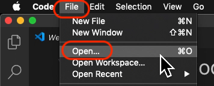
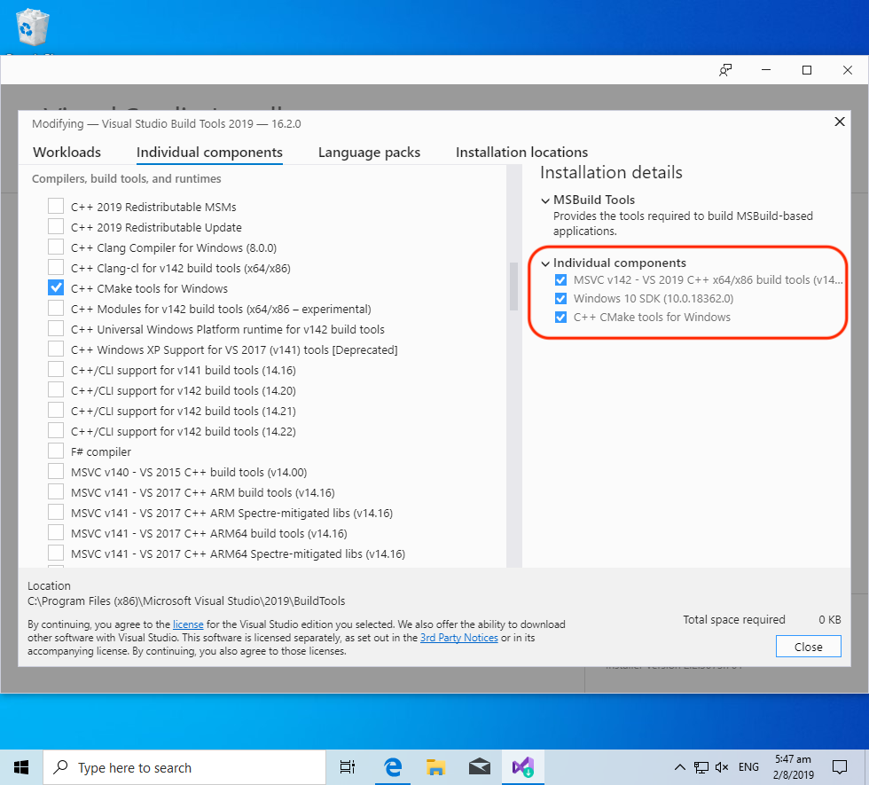
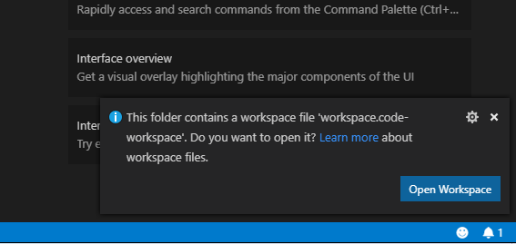
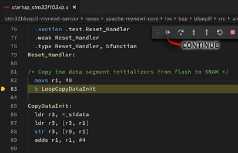
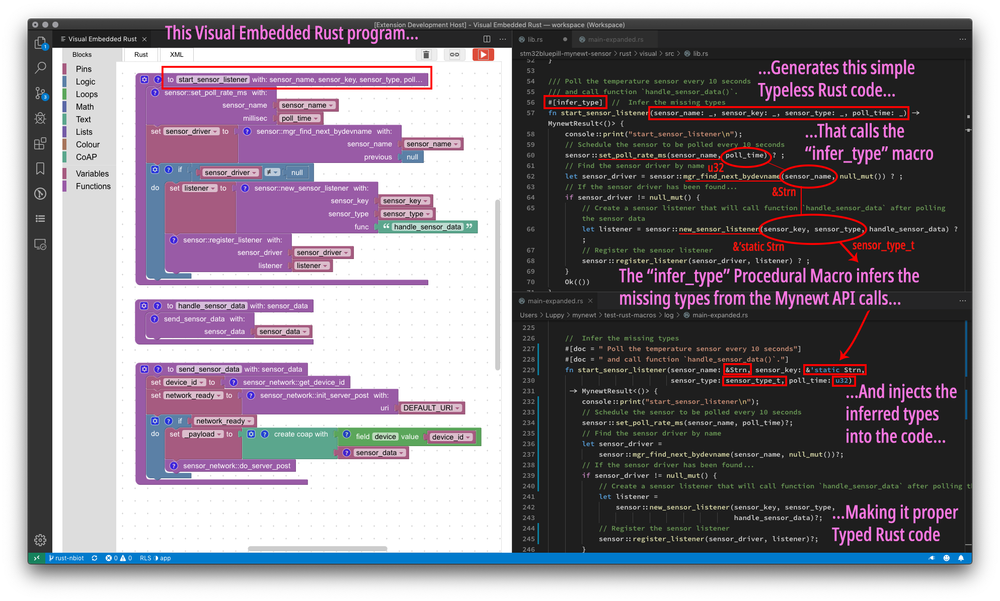
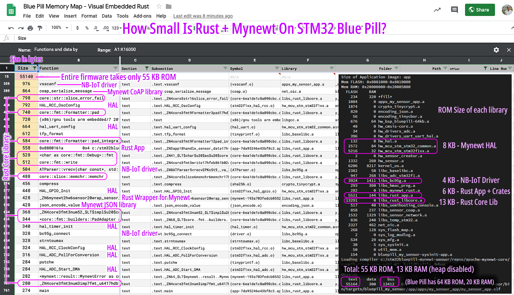
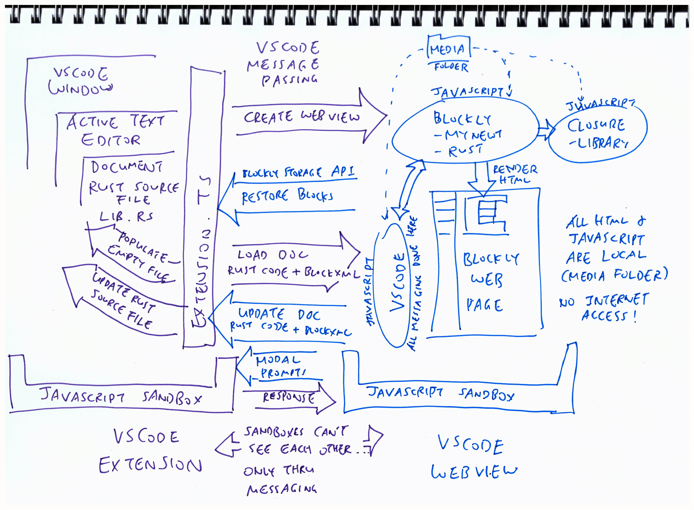

# visual-embedded-rust

- Create and edit Embedded Rust programs visually by dragging and dropping blocks

- Generates Embedded Rust code for [STM32 Blue Pill](https://medium.com/swlh/super-blue-pill-like-stm32-blue-pill-but-better-6d341d9347da?source=friends_link&sk=956087171b9b9efcc484ea60b9c78c16) with [Apache Mynewt](https://mynewt.apache.org/) realtime operating system

# Features

Watch the demo...

[微博视频](https://weibo.com/7285313566/I2MWZ1CnK)

[YouTube Video](https://youtu.be/ytGa-7q6sqY)

Read the articles...

1. [_"Visual Embedded Rust Programming with Visual Studio Code"_](https://medium.com/@ly.lee/visual-embedded-rust-programming-with-visual-studio-code-1bc1262e398c?source=friends_link&sk=222de63e45993aacd0db5a2e4b1f33c7)

1. [_"Advanced Topics for Visual Embedded Rust Programming"_](https://medium.com/@ly.lee/advanced-topics-for-visual-embedded-rust-programming-ebf1627fe397?source=friends_link&sk=01f0ae0e1b82efa9fd6b8e5616c736af)

1. [_"Rust Rocks NB-IoT! STM32 Blue Pill with Quectel BC95-G on Apache Mynewt"_](https://medium.com/@ly.lee/rust-rocks-nb-iot-stm32-blue-pill-with-quectel-bc95-g-on-apache-mynewt-ef62a7e28f7e?source=friends_link&sk=aaa21371f68a07c543066b6b89a760f0)

1. [_"Visual Programming with Embedded Rust? Yes we can with Apache Mynewt and Google Blockly!"_](https://medium.com/@ly.lee/visual-programming-with-embedded-rust-yes-we-can-with-apache-mynewt-and-google-blockly-8b67ef7412d7?source=friends_link&sk=353fb92b6f20ebf885ff5c9be44fd6f2)


# Usage

1. In Visual Studio Code, Click `File → Open` to open any folder

    

1. In the `Explorer → (Folder Name)` pane at top left, create a new Rust source file, like `lib.rs`

    

1. Edit the Rust source file. Click `Visual Editor` at top right

    

1. When prompted to populate the visual program into the Rust source file, click `OK`

    

1. Click the Rust source file to see the generated Rust code. Save the file to save the visual program. Don't edit the Rust source file manually, always use the visual editor.

[Sample Rust source file containing generated Rust code and XML blocks](https://github.com/lupyuen/stm32bluepill-mynewt-sensor/blob/rust-nbiot/rust/visual/src/lib.rs)


# Build The Firmware

To compile the generated Rust program into Blue Pill firmware...

1. Click here to install `Build Tools For Visual Studio 2019`: <br>
    https://visualstudio.microsoft.com/downloads/#build-tools-for-visual-studio-2019

1. Click the `Individual Components` tab

    Select the following components: <br>
    `Windows 10 SDK (10.0.18362.0)` <br>
    `C++ CMake Tools for Windows` <br>
    (This should be automatically selected) `MSVC v142 — VS 2019 C++ x64/x86 Build Tools`

    

1. Install rustup according to the instructions here: <br>
    https://rustup.rs

    Click the link provided to download `rustup‑init.exe` <br>
    Launch the downloaded file `rustup‑init.exe` <br>

    If you see the message `Windows Defender SmartScreen prevented an unrecognised app from starting`… <br>
    Click `More Info` <br>
    Click `Run Anyway` <br>

    At the `Welcome to Rust!` prompt, press Enter to select the default option: <br>
    `1) Proceed with installation (default)`

1. Open the Windows Command Prompt. Enter into the command prompt:

    ```
    rustup default nightly
    rustup update
    rustup target add thumbv7m-none-eabi
    rustc -V
    ```

    The reported version of rustc should be 1.38.0 or later: <br>
    `rustc 1.38.0-nightly (435236b88 2019–08–01)`

1. Download the `stm32bluepill-mynewt-sensor.7z` file attached below… <br>
    https://github.com/lupyuen/stm32bluepill-mynewt-sensor/releases/tag/v7.0.3

    Expand the `.7z` file with 7zip… <br>
    https://www.7-zip.org/download.html

1. Install Arm Cross-Compiler and Linker for Windows from Arm Developer Website… <br>
    https://developer.arm.com/-/media/Files/downloads/gnu-rm/8-2019q3/RC1.1/gcc-arm-none-eabi-8-2019-q3-update-win32-sha1.exe?revision=fcadabed-d946-49dc-8f78-0732d2f43773?product=GNU%20Arm%20Embedded%20Toolchain,32-bit,,Windows,8-2019-q3-update

    Select this option at the last install step: <br>
    `Add path to environment variable`

1. Download the ST-Link USB driver from ST-Link Driver Website (email registration required)… <br>
    https://www.st.com/en/development-tools/stsw-link009.html

    Click `Get Software` <br>
    Unzip the downloaded file. Double-click the driver installer: <br>
    `dpinst_amd64.exe`

1. Launch Visual Studio Code <br>
    Install the extension “Cortex-Debug”… <br>
    https://marketplace.visualstudio.com/items?itemName=marus25.cortex-debug

1. Click `File → Open Folder`

    Select the downloaded folder `stm32bluepill-mynewt-sensor`

    When prompted to open the workspace, click `Open Workspace`

    

1. Copy the Rust source file containing the generated code to `rust/app/src/lib.rs`. Overwrite the existing file.

1. Delete the files `app_network.rs` and `app_sensor.rs` in that folder

1. If you have a Quectel NB-IoT module… <br>

    Open the following file and configure the program settings: <br>
    `targets/bluepill_my_sensor/syscfg.yml` <br>
    Change the NB-IoT band setting `NBIOT_BAND`. Check with your NB-IoT operator for the band to use.

1. Click `Terminal → Run Task → [1] Build bluepill_boot`

    This builds the bootloader, which starts the Apache Mynewt operating system upon startup. If it shows errors, [compare with this build log](https://github.com/lupyuen/stm32bluepill-mynewt-sensor/blob/rust-nbiot/logs/build-bootloader.log).

1. Click `Terminal → Run Task → [2] Build bluepill_my_sensor`

    This builds the firmware containing our Rust program. [Compare with this build log](https://github.com/lupyuen/stm32bluepill-mynewt-sensor/blob/rust-nbiot/logs/build-application.log).

    When our Rust program has been successfully compiled as Blue Pill ROM firmware, we should see this…

    

1. Click `Terminal → Run Task → [3] Image bluepill_my_sensor`

    This creates the Blue Pill flash image from the firmware. [Compare with this image log](https://github.com/lupyuen/stm32bluepill-mynewt-sensor/blob/rust-nbiot/logs/image.log)

    If any source files or configuration files are changed, rebuild the application by clicking <br>
    `Terminal → Run Task → [2] Build bluepill_my_sensor`

# Connect The Hardware


We’ll need the following hardware…

1. __STM32 Blue Pill:__ Under $2, search [AliExpress](https://www.aliexpress.com/wholesale?catId=0&initiative_id=SB_20180924131057&SearchText=stm32f103c8t6+development+board&switch_new_app=y) for `stm32f103c8t6 development board`

1. __ST-Link V2 USB Adapter:__ Under $2, search [AliExpress](https://www.aliexpress.com/wholesale?catId=0&initiative_id=SB_20180924134644&SearchText=st-link+v2&switch_new_app=y) for `st-link v2`

__Optional:__ To transmit data to the NB-IoT network, we’ll also need…

1. __Quectel BC95-G Global NB-IoT Module__ ([breakout board with antenna](https://www.aliexpress.com/wholesale?catId=0&initiative_id=SB_20190725022150&SearchText=bc95-g+nb101&switch_new_app=y))

    I ordered mine [from Taobao](https://item.taobao.com/item.htm?id=577310122904). [The manual in Chinese is here](http://rs.iotxx.com/uploads/doc/%E8%B0%B7%E9%9B%A8NB10x%E4%BD%BF%E7%94%A8%E8%AF%B4%E6%98%8E%E4%B9%A6-V1.3.pdf).

    BC95-G works in all NB-IoT frequency bands worldwide. If you’re buying a different NB-IoT module, check that it supports your local NB-IoT Frequency Band. (For example: In Singapore I’m using NB-IoT Frequency Band 8 with StarHub)

1. __NB-IoT SIM__ from your local NB-IoT network operator

    Many thanks to [StarHub](https://www.starhub.com/) for sponsoring the NB-IoT SIM that I used for this tutorial!

Connect Blue Pill to Quectel BC95-G and ST-Link as follows…

| Blue Pill          | Quectel BC95-G | ST-Link V2        | Wire Colour |
| :---               | :---           | :---              | :---        |
| `PA2 (UART2 TX2)`  | `RXD (Pin 4)`  |                   | Green  |
| `PA3 (UART2 RX2)`  | `TXD (Pin 3)`  |                   | Blue   |
| `GND`              | `GND (Pin 1)`  |                   | Black  |
|                    | `VCC (Pin 2)`  | `5.0V   (Pin 10)` | Yellow |
| `3V3`              |                | `3.3V   (Pin 8)`  | Red    |
| `DIO`              |                | `SWDIO  (Pin 4)`  | Orange |
| `DCLK`             |                | `SWDCLK (Pin 2)`  | Brown  |
| `GND`              |                | `GND    (Pin 6)`  | Black  |

Both yellow jumpers on Blue Pill should be set to the 0 position, as shown in the above photo.

Note that we are powering the Quectel module with 5V from ST-Link instead of 3.3V from Blue Pill. That’s because the module requires more power than Blue Pill can provide. (How did I find out? Because the module kept restarting when I powered it from Blue Pill.)

Check the documentation for your Quectel breakout board to confirm that it supports 5V. ([Mine does](http://rs.iotxx.com/uploads/doc/%E8%B0%B7%E9%9B%A8NB10x%E4%BD%BF%E7%94%A8%E8%AF%B4%E6%98%8E%E4%B9%A6-V1.3.pdf))

Insert the NB-IoT SIM according to the orientation shown in the photo. (Yes the SIM notch faces outward, not inward)

Remember: Always connect the antenna before powering up the NB-IoT module!

If you’re using Windows: Make sure that the ST-Link Driver has been installed before connecting ST-Link to your computer

 <br>
_SIM partially exposed to show the unusual orientation_

# Flash The Firmware To Blue Pill


1. Check that the Blue Pill is connected to ST-Link… <br>
    And that the ST-Link is connected to your computer’s USB port. <br>
    Now let’s head back to Visual Studio Code…

1. Click `Terminal → Run Task → [4] Load bluepill_boot`

    This flashes the bootloader to Blue Pill, to start the Apache Mynewt operating system upon startup. If it shows errors, [compare with this flash log](https://github.com/lupyuen/stm32bluepill-mynewt-sensor/blob/rust-nbiot/logs/load-bootloader.log).

1. Click `Terminal → Run Task → [5] Load bluepill_my_sensor`

    This flashes the firmware (containing our Visual Program) to Blue Pill. If it shows errors, [compare with this flash log](https://github.com/lupyuen/stm32bluepill-mynewt-sensor/blob/rust-nbiot/logs/load-application.log).

# Run The Program

1. Click `Debug → Start Debugging`

1. Click `View → Output`

    Select `Adapter Output` to see the Blue Pill log

    

1. The debugger pauses at the line with `LoopCopyDataInit`

    Click `Continue` or press `F5`

    

1. The debugger pauses next at the `main()` function.

    Click `Continue` or press `F5`

    

Our Blue Pill should now poll its internal temperature sensor every 10 seconds. It should also transmit the temperature data to the CoAP server hosted at thethings.io.

[The Blue Pill log should look like this](https://github.com/lupyuen/stm32bluepill-mynewt-sensor/blob/rust-nbiot/logs/visual.log). The log is explained [in this article](https://medium.com/@ly.lee/connect-stm32-blue-pill-to-nb-iot-with-quectel-bc95-g-and-apache-mynewt-c99a9d8417a9?source=friends_link&sk=34fb9befbea42e98cb5942d66f594027).

[微博视频](https://weibo.com/7285313566/I2MZOeP0F)

[YouTube Video](https://youtu.be/PL4Yj3IS5ck)

Upon clicking the URL `https://blue-pill-geolocate.appspot.com/?device=5cfca8c…` that’s shown in the Blue Pill log, we’ll see a web page that displays the temperature received by the server at thethings.io.
The server has converted the raw temperature into degrees Celsius. We convert the temperature at the server to conserve RAM and ROM on Blue Pill.

 <br>
_Display of sensor data received from our Blue Pill_

The following files may be useful for reference…

- [Disassembly of the Rust Application build](https://github.com/lupyuen/stm32bluepill-mynewt-sensor/blob/rust-nbiot/logs/libapp-demangle.S)

- [Disassembly of the Rust Crates](https://github.com/lupyuen/stm32bluepill-mynewt-sensor/blob/rust-nbiot/logs/rustlib-demangle.S)

- [Disassembly of the entire firmware](https://github.com/lupyuen/stm32bluepill-mynewt-sensor/blob/rust-nbiot/logs/my_sensor_app.elf.lst)

- [Memory map of the firmware](https://github.com/lupyuen/stm32bluepill-mynewt-sensor/blob/rust-nbiot/logs/my_sensor_app.elf.map)

[Read more about hosting Rust applications on Mynewt](https://medium.com/@ly.lee/hosting-embedded-rust-apps-on-apache-mynewt-with-stm32-blue-pill-c86b119fe5f?source=friends_link&sk=f58f4cf6c608fded4b354063e474a93b)

# Function 1: On Start


`On Start` marks the start of the program. Here we define some constants — values used by the program that won’t change as the program runs…

1. `SENSOR_DEVICE` is the name of the sensor that the program will poll (check periodically). We’ll be polling Blue Pill’s Internal Temperature Sensor, which is named `temp_stm32_0`

1. `SENSOR_POLL_TIME` is the time interval (in milliseconds) for polling the sensor. We’ll set this to 10 seconds (or 10,000 milliseconds)

1. `TEMP_SENSOR_KEY` is the name of the sensor data field that our program will send to the server. We’ll call it `t` to tell the server we’re sending a temperature value.

1. `TEMP_SENSOR_TYPE` is the type of sensor data that our program will send: Raw ambient temperature in whole numbers (integers from 0 to 4095), hence `SENSOR_TYPE_AMBIENT_TEMPERATURE_RAW`

Why do we send the temperature in raw form instead of the usual decimal (floating-point) form like 28.9 degrees Celsius? That’s because Blue Pill has very limited RAM and ROM. Sending the raw temperature without conversion will save us from reserving RAM and ROM that would be needed for the floating-point conversion. We’ll let the server convert instead.

By Rust convention, constants are named in uppercase. Hence we name the constants as `SENSOR_DEVICE` instead of sensor_device


Next we call the function `start_sensor_listener` to begin polling the temperature sensor every 10 seconds. More about this in the next section.


Finally we call `start_server_transport`, which is a system function defined in the `sensor_network` library. This function starts a background task to establish a connection to the NB-IoT network. For this tutorial, we’ll be transmitting sensor data over the NB-IoT network, which is available worldwide.

It may take a few seconds to complete, but the function executes in the background so it won’t hold up other tasks, like polling the temperature sensor.

Take note of the Rust convention… `sensor_network::start_server_transport` refers to the function `start_server_transport` that’s found inside the Rust Library `sensor_network`. Rust Libraries are also known as “Crates”.

How was the `On Start` function created?
By dragging and dropping the blocks from the Blocks Bar at the left of the Visual Program.
That’s how we create a Visual Program… By arranging the blocks to compose a program!

[微博视频](https://weibo.com/7285313566/I2MOamxS9)

[YouTube Video](https://youtu.be/Qw1N-01PAy8)


# Function 2: Start Sensor Listener


`To start_sensor_listener With ...` is the way that we define functions in the Visual Program. Here we define `start_sensor_listener` as a function that accepts 4 parameters (or inputs), whose values we have seen from the previous section…

1. `sensor_name`: Name of the sensor to be polled. Set to `SENSOR_DEVICE` (i.e. `temp_stm32_0`)

1. `sensor_key`: Name of the sensor data field to be sent to the server. Set to `TEMP_SENSOR_KEY` (i.e. `t`)

1. `sensor_type`: Type of sensor data that will be sent to the server. Set to `SENSOR_TYPE_AMBIENT_TEMPERATURE_RAW`

1. `poll_time`: Time interval (in milliseconds) for polling the sensor. Set to `SENSOR_POLL_TIME` (i.e. 10,000 milliseconds or 10 seconds)


Next we call the system function `set_poll_rate_ms`, defined in the `sensor` library. The `sensor` library comes from the Apache Mynewt operating system, which manages all sensors on Blue Pill.

By calling the function `set_poll_rate_ms` with `sensor_name` set to `temp_stm32_0` and `poll_time` set to `10000` (milliseconds), we are asking the system to poll the temperature sensor every 10 seconds. And the system will happily fetch the temperature value on our behalf every 10 seconds.

What shall we do with the temperature value? We’ll define a Listener Function to transmit the data. But first…


We call function `mgr_find_next_bydevname` (also from the `sensor` library) to fetch the sensor driver from the system and store it in the variable `sensor_driver`. By passing the `sensor_name` as `temp_stm32_0`, the function returns the driver responsible for managing the temperature sensor. The driver will be used for setting the Listener Function in a while.


Before that, we check the sensor driver was actually found. If we had misspelt the name of the sensor, the sensor driver would not be found and it would be set to `null`, a special Rust value that means “nothing”. Hence we check to ensure that `sensor_driver` is not `null`.


We create a sensor listener (stored as `listener`) by calling the system function `new_sensor_listener`, passing in the `sensor_key` (set to `t`) and the `sensor_type` (raw ambient temperature). func is the name of the Listener Function that will be called after reading the sensor data: `handle_sensor_data`. Which we’ll cover in the next section.


To register the Listener Function in the system, we call the system function `register_listener`, passing in the `sensor_driver` and the sensor listener that we have just created.

After that, the operating system will automatically read the temperature sensor every 10 seconds and call our function `handle_sensor_data` with the temperature value.

[微博视频](https://weibo.com/7285313566/I2MWZ1CnK)

[YouTube Video](https://youtu.be/ytGa-7q6sqY)

# Function 3: Handle Sensor Data


How shall we handle the temperature data that has been read? `handle_sensor_data` passes the sensor data to another function `send_sensor_data` that transmits the sensor data to the server. More about `send_sensor_data` in a while.

The function `handle_sensor_data` doesn’t seem to do much… why did we design the program this way? It’s meant for future expansion — when we need more complicated logic for handling sensor data, we’ll put the logic into `handle_sensor_data`

`handle_sensor_data` could be extended to handle multiple sensors, aggregating the sensor data before transmitting. Or it could check for certain conditions and decide whether it should transmit the data. This program structure gives us the most room to expand for the future.

# Function 4: Send Sensor Data


The final function in our program, `send_sensor_data`, is called by `handle_sensor_data` to transmit sensor data. The parameter `sensor_data` contains the field name `t` and the sensor value, like `1715`. Remember that this is a raw temperature value. The server will convert the raw value to degrees Celsius later.


We call `get_device_id` from the `sensor_network` library to fetch the Device ID from the system. This is a long string of random letters and digits like `a8b2c7d8e9b2...` Each time we restart Blue Pill we’ll get a different Device ID. We’ll use this Device ID later to identify our Blue Pill uniquely and check whether the server has received the temperature sensor data from our Blue Pill.


Next we call `init_server_post` (also from `sensor_network` library) to prepare a sensor data message that will be sent to the server. Because Blue Pill has limited RAM, this function will ensure that only one task is allowed to compose messages at any time. The other tasks will have to wait for their turn.


`init_server_post` returns a true/false result (known as a boolean) that indicates whether the NB-IoT network connection has been established. This stored in the variable `network_ready`.

Only when `network_ready` is true, which means that the device has connected to the NB-IoT network, then we proceed to compose a CoAP Message.


What’s a CoAP Message? It’s a standard format for transmitting sensor data over NB-IoT. Here we are transmitting two data values in the CoAP Message...

1. `device_id`: The randomly-generated Device ID that uniquely identifies our Blue Pill. This field shall be transmitted with the field name device

1. `sensor_data`: Contains the field name `t` and the sensor value, like `1715`


The CoAP Message is transmitted only when function `do_server_post` is called. Again this transmission takes place in a background task, so it won’t hold up our program from polling the sensor.

Notice that `_payload` is named differently… it begins with an underscore `_`. By Rust convention, variables that are set but not read should be named with an underscore `_` as the first character. Because the Rust Compiler will warn us about unused variables.

This effectively tells the Rust Compiler: _“Yes I’m setting the variable `_payload` and I’m not using the value… Please don’t warn me that I may have misspelt the name `_payload`"_


At the end of the function, we display a URL in the Blue Pill log that contains the Device ID. The URL looks like this: https://blue-pill-geolocate.appspot.com/?device=5cfca8c…
We’ll click this URL to verify that the server has received our sensor data.

# Generated Code: Typeless Rust

To making coding easier for beginners, the extension generates Typeless Rust code like this...

```rust
#[infer_type]  //  Infer the missing types
fn start_sensor_listener(sensor_name: _, sensor_key: _, sensor_type: _, poll_time: _) ...
    //  Call Mynewt API
    sensor::set_poll_rate_ms(sensor_name, poll_time) ? ;
```

When the typeless code is compiled, the [`infer_type` Procedural Macro](https://github.com/lupyuen/stm32bluepill-mynewt-sensor/blob/rust-nbiot/rust/macros/src/infer_type.rs) infers the types by matching the variables against the Mynewt API...

```rust
//  Call Mynewt API
sensor::set_poll_rate_ms(sensor_name, poll_time) ? ;  
//  `sensor_name` inferred as type `&Strn`
//  `poll_time`   inferred as type `u32`
```

The macro then injects the inferred types into the typeless code...

```rust
fn start_sensor_listener(sensor_name: &Strn, sensor_key: &'static Strn,
                         sensor_type: sensor_type_t, poll_time: u32) ...
```

The inferred types are stored in [`infer.json`](https://github.com/lupyuen/stm32bluepill-mynewt-sensor/blob/rust-nbiot/infer.json). The enables the types inferred in one function to be inferred for other functions...

```json
    "start_sensor_listener": [
        [ "sensor_name", "&Strn" ],
        [ "sensor_key",  "&'static Strn" ],
        [ "sensor_type", "sensor_type_t" ],
        [ "poll_time",   "u32" ]
    ],
    "send_sensor_data": [
        [ "sensor_data", "&SensorValue" ]
    ],
    "handle_sensor_data": [
        [ "sensor_data", "&SensorValue" ]
    ]
```

This diagram illustrates the Type Inference…

 <br>
_How the infer_type macro infers missing types_

Here’s an animation (done with Visual Studio Code) that explains how the types were inferred by the `infer_type` macro. At top left are the types to be inferred. At bottom left are the known type signatures from the Mynewt API.

The `infer_type` macro scans the Typeless Rust program recursively, hence we see the roving red highlight. When the macro finds a match with the Mynewt API, the code flashes green.

Green ticks at the top left mean that we have successfully inferred the types.

The recursive Rust code parsing was implemented with the excellent `syn` crate. The `quote` crate was used to emit the transformed Rust code.

[微博视频](https://weibo.com/7285313566/I2N12aA4W)

[YouTube Video](https://youtu.be/1SCLlwK5KwE)

 <br>
_How the infer_type macro infers missing types, animated in Visual Studio Code with the Visual Embedded Rust Extension_

More details in the article [_"Advanced Topics for Visual Embedded Rust Programming"_](https://medium.com/@ly.lee/advanced-topics-for-visual-embedded-rust-programming-ebf1627fe397?source=friends_link&sk=01f0ae0e1b82efa9fd6b8e5616c736af)

# How Small Is Rust?

Here’s the RAM and ROM usage of the Visual Embedded Rust firmware on Blue Pill. The left section shows Rust and Apache Mynewt functions sorted by size (largest on top). The right section shows the total RAM and ROM used by each library.

Our firmware occupies 55 KB of ROM and 13 KB of RAM, out of Blue Pill’s 64 KB ROM and 20 KB RAM. (That’s __86% of ROM__ and __65% of RAM__ used)

[The spreadsheet below](https://docs.google.com/spreadsheets/d/1zIDfQmRcQ_wxGIPsq7MOxk7XzBO5-TL9R25TSFxaopU/edit#gid=381366828&fvid=1643056349) was generated based on the [Linker Memory Map](https://github.com/lupyuen/stm32bluepill-mynewt-sensor/blob/rust-nbiot/logs/my_sensor_app.elf.map) created during the firmware build. [Read more about memory maps](https://medium.com/@ly.lee/stm32-blue-pill-analyse-and-optimise-your-ram-and-rom-9fc805e16ed7)

 <br>
_RAM and ROM usage of the Visual Embedded Rust firmware_

# Why Blue Pill? Power vs Price Compromise


Blue Pill was chosen for the tutorial because it best represents a real-world, low-cost microcontroller with limited RAM and ROM.

The microcontroller is found in many off-the-shelf products, even [flying drones](https://timakro.de/blog/bare-metal-stm32-programming/)!

To be clear what’s a “Blue Pill”… The heart of Blue Pill is an STMicroelectronics __STM32F103C8T6__ microcontroller.

That’s a tiny module surface-mounted on a Blue printed-circuit board (hence the name Blue Pill). Without the Blue (and Yellow) parts, it would be extremely difficult for us to experiment with the microcontroller. So we buy a Blue Pill and use it like an Arduino.


Thus Blue Pill is clearly a Developer Kit that marks up the cost of the microcontroller. Blue Pill retails for $2, but the STM32F103C8T6 microcontroller [sells for only 40 cents](https://s.taobao.com/search?ie=utf8&initiative_id=staobaoz_20190817&stats_click=search_radio_all%3A1&js=1&imgfile=&q=stm32f103c8t6%E8%8A%AF%E7%89%87&suggest=0_1&_input_charset=utf-8&wq=STM32F103C8T6&suggest_query=STM32F103C8T6&source=suggest)! _Perfect for creating millions and millions of IoT sensors!_

_(Actually a $2 dev kit is so affordable that it begs you to go ahead and do [many](https://www.linkedin.com/posts/lupyuen_nbiot-stm32-quectel-activity-6562722168394878976-0ld5) [many](https://www.linkedin.com/posts/lupyuen_stm32-quectel-nbiot-activity-6558570814986387456-ajVF) crazy things with it!)_

At this price we get a 32-bit Arm processor with many goodies (GPIO, UART, I2C, SPI, USB, …) But the catch: It has only __64 KB of ROM and 20 KB of RAM.__ _([Similar to the Apple II](https://en.wikipedia.org/wiki/Apple_II_Plus)!)_

With Blue Pill’s extremely limited RAM and ROM, we can’t code in decent programming languages like MicroPython and JavaScript (for MakeCode, which I tried and failed).

C was the only option… Until Rust came along! Rust is a systems programming language that’s as low level as C (i.e. no garbage collection). Yet it solves the painful pointer problem in C. 

[This research paper presents an excellent comparison of C with Rust](https://mssun.me/assets/ares19securing.pdf)

[Read more about Blue Pill and the upgraded version, Super Blue Pill](https://medium.com/swlh/super-blue-pill-like-stm32-blue-pill-but-better-6d341d9347da)

# Inside The Visual Embedded Rust Extension for Visual Studio Code

The source code for the Visual Embedded Rust extension is located at github.com/lupyuen/visual-embedded-rust

The extension is published in the [Visual Studio Marketplace here](https://marketplace.visualstudio.com/items?itemName=LeeLupYuen.visual-embedded-rust&ssr=false#overview)

The extension wraps the web-based visual code editor from [Google Blockly](https://developers.google.com/blockly/guides/overview) into a [VSCode WebView](https://code.visualstudio.com/api/extension-guides/webview). Blockly uses XML to represent a visual program.

The extension is activated when we [edit a Rust source file](https://github.com/lupyuen/visual-embedded-rust/blob/master/package.json#L41-L49) (`*.rs`). [Here’s a sample Rust source file containing a Visual Program](https://github.com/lupyuen/stm32bluepill-mynewt-sensor/blob/rust-nbiot/rust/visual/src/lib.rs)

There are two parts of the file…

1. __Rust Source Code:__ Which is autogenerated by the Blockly Code Generator from the Blockly XML

1. __Blockly XML:__ The XML representation of the visual program. It’s located at the bottom of the source file, marked by `BEGIN BLOCKS … END BLOCKS`

 <br>
_Logic Flow in the Visual Embedded Rust Extension_

1. Main logic for the VSCode Extension is in [extension.ts](https://github.com/lupyuen/visual-embedded-rust/blob/master/src/extension.ts)

    The extension contains two asset folders:

    [`resources`](https://github.com/lupyuen/visual-embedded-rust/tree/master/resources): Contains a [visual program template](https://github.com/lupyuen/visual-embedded-rust/blob/master/resources/template.rs) that will be used to populate empty Rust source files

    [`media`](https://github.com/lupyuen/visual-embedded-rust/tree/master/media): Contains the Blockly JavaScript code that will be embedded in the WebView to render the visual editor and generate Rust source code…

    [`media/blockly-mynewt-rust`](https://github.com/lupyuen/blockly-mynewt-rust) contains the Blockly JavaScript code with a custom Rust Code Generator

    [`media/closure-library`](https://github.com/google/closure-library) is the Google Closure Library needed by Blockly

    [`media/vscode`](https://github.com/lupyuen/visual-embedded-rust/tree/master/media/vscode) contains JavaScript code that enables VSCode Message Passing in the WebView to implement save/load functions and modal prompts 

1. The extension creates a [WebView that embeds the HTML and JavaScript code](https://github.com/lupyuen/visual-embedded-rust/blob/master/src/extension.ts#L88-L144) from [Google Blockly](https://developers.google.com/blockly/guides/overview).

    [HTML code for the WebView is here](https://github.com/lupyuen/visual-embedded-rust/blob/master/src/web.ts)

1. The VSCode Extension and the WebView are running in [separate JavaScript sandboxes](https://code.visualstudio.com/api/extension-guides/webview#scripts-and-message-passing).

    Hence we’ll be using VSCode Message Passing to communicate between the VSCode Extension and WebView, as we shall soon see…

1. [When the WebView loads](https://github.com/lupyuen/visual-embedded-rust/blob/master/media/vscode/storage.js#L59-L71), it notifies the VSCode Extension to fetch the contents of the Rust source file.

    The VSCode Extension responds by [passing the contents of the active Rust source file to the WebView](https://github.com/lupyuen/visual-embedded-rust/blob/master/src/extension.ts#L168-L186) via Message Passing.

    The WebView [extracts the Blockly XML](https://github.com/lupyuen/visual-embedded-rust/blob/master/media/vscode/message.js#L40-L60) embedded in the file contents ([at the bottom](https://github.com/lupyuen/stm32bluepill-mynewt-sensor/blob/rust-nbiot/rust/visual/src/lib.rs#L159)). The WebView refreshes the Blockly workspace with the Blockly XML.

    If the active Rust source file is empty, the VSCode Extension [populates the file](https://github.com/lupyuen/visual-embedded-rust/blob/master/src/extension.ts#L155-L202) with a [template containing Blockly XML](https://github.com/lupyuen/visual-embedded-rust/blob/master/resources/template.rs)

1. When the [visual program is updated](https://github.com/lupyuen/visual-embedded-rust/blob/master/media/vscode/storage.js#L194-L207), the WebView sends the [updated Blockly XML and the generated Rust code](https://github.com/lupyuen/visual-embedded-rust/blob/master/media/vscode/message.js#L79-L89) (via [Message Passing](https://github.com/lupyuen/visual-embedded-rust/blob/master/media/vscode/storage.js#L187-L192)) to the VSCode Extension.

    The extension [updates the Rust document](https://github.com/lupyuen/visual-embedded-rust/blob/master/src/extension.ts#L203-L223) in VSCode with the Blockly XML and generated Rust Code.

1. The custom-built Rust Code Generator for Blockly is here…

    github.com/lupyuen/blockly-mynewt-rust/blob/master/generators/rust.js

    github.com/lupyuen/blockly-mynewt-rust/tree/master/generators/rust

    The Rust Code Generator for Blockly is [explained in this article](https://medium.com/@ly.lee/visual-programming-with-embedded-rust-yes-we-can-with-apache-mynewt-and-google-blockly-8b67ef7412d7)

# Building The Visual Embedded Rust Extension

To build the extension, two repositories need to be cloned into the media folder: [`blockly-mynewt-rust`](https://github.com/lupyuen/blockly-mynewt-rust) and [`closure-library`](https://github.com/google/closure-library):

```bash
cd media
git clone https://github.com/lupyuen/blockly-mynewt-rust
git clone https://github.com/google/closure-library
```

# Release Notes

For changelog refer to...

1.  [`github.com/lupyuen/visual-embedded-rust/commits/master`](https://github.com/lupyuen/visual-embedded-rust/commits/master)

1.  [`github.com/lupyuen/blockly-mynewt-rust/commits/master`](https://github.com/lupyuen/blockly-mynewt-rust/commits/master)

1.  [`github.com/lupyuen/stm32bluepill-mynewt-sensor/commits/rust-nbiot`](https://github.com/lupyuen/stm32bluepill-mynewt-sensor/commits/rust-nbiot)
