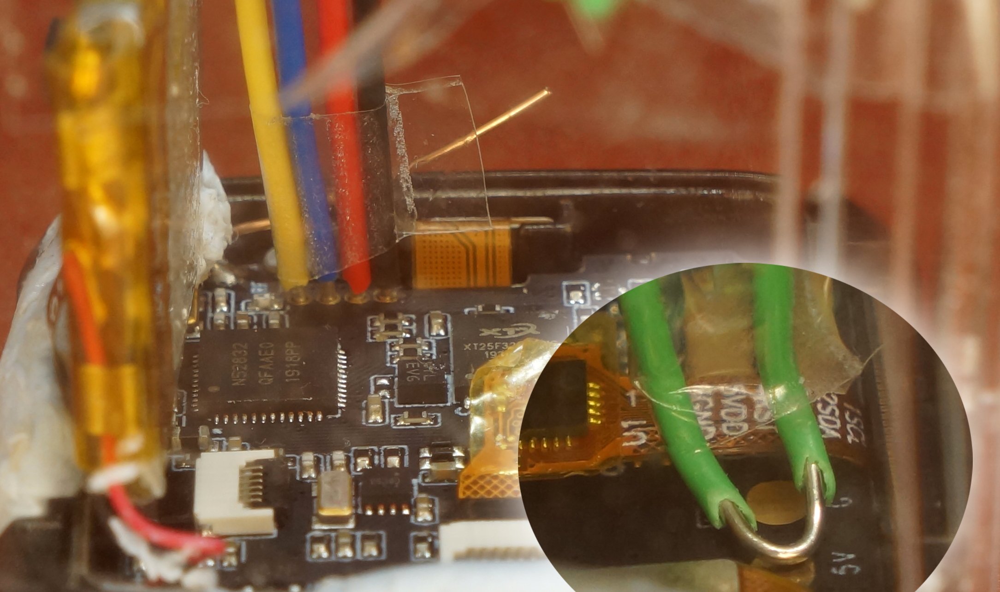
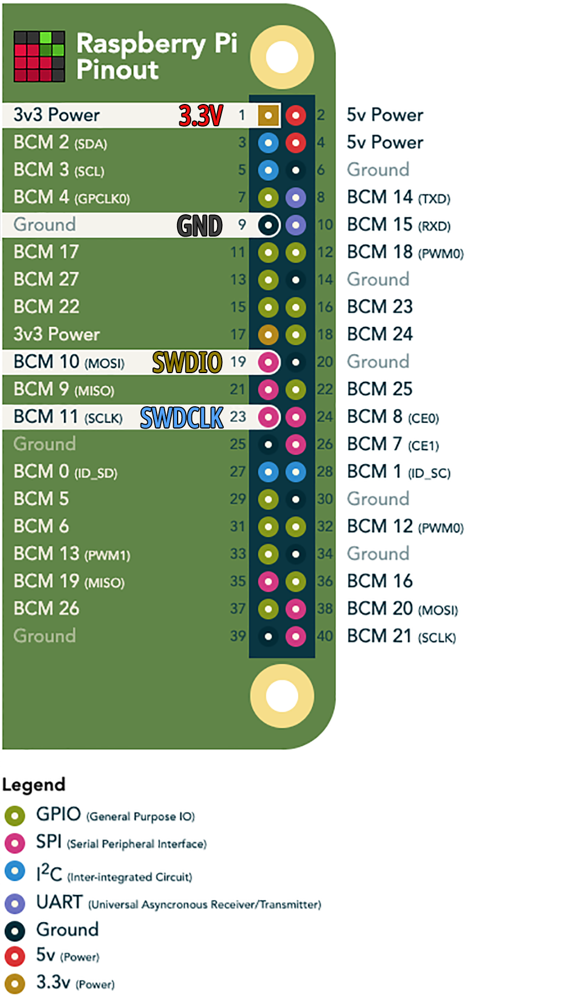
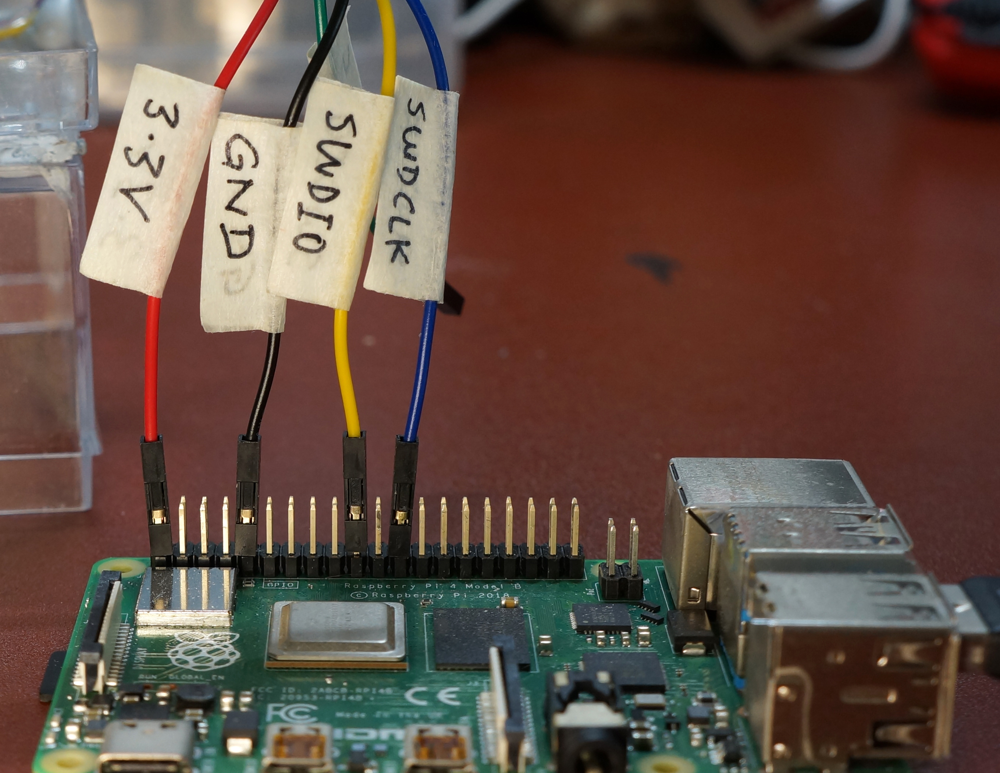
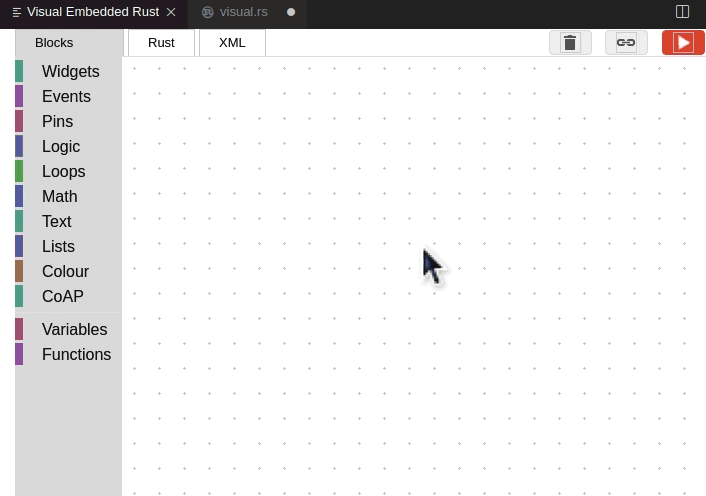
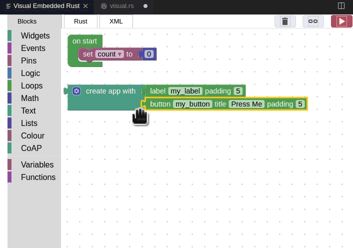
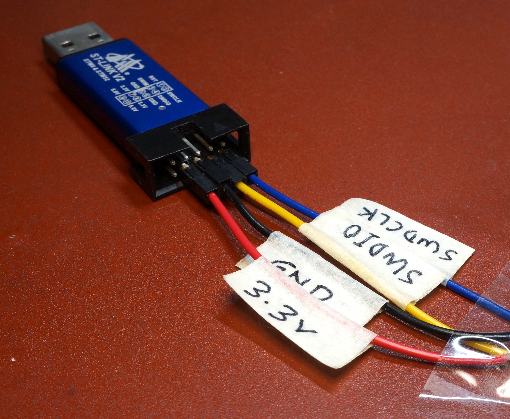

# visual-embedded-rust

- Create and edit Embedded Rust programs visually by dragging and dropping blocks

- Generates Embedded Rust firmware code for [__PineTime Smart Watch__](https://wiki.pine64.org/index.php/PineTime) hosted on [__Apache Mynewt__](https://mynewt.apache.org/) realtime operating system, with [__druid UI Framework__](https://github.com/lupyuen/druid-embedded)

- Hardware Required: PineTime Smart Watch and Raspberry Pi (preferably Pi 4 with Raspbian)


# Connect PineTime to Raspberry Pi

1️⃣ Carefully pry open the PineTime casing. Use tweezers to pivot the shiny battery gently to the side. Be careful not to break the red and black wires that connect the battery to the watch!

2️⃣ Just above the battery we see 4 shiny rings. This is the __[Serial Wire Debug](https://en.wikipedia.org/wiki/JTAG#Serial_Wire_Debug) (SWD)__ Port for PineTime. We’ll use this port to flash our firmware to PineTime. The 4 pins (from left to right) are SWDIO (Data I/O), SWDCLK (Clock), 3.3V, GND.

🛈 [_What is “flash memory” / “flashing” / “firmware”? Read this_](https://gist.github.com/lupyuen/41fffaddade277d27c48697bca21d837)



The exposed copper wire at the top centre of the photo is the Bluetooth antenna. Bend it upwards so that it doesn’t come into contact with anything.


3️⃣ At lower right we see a pad marked 5V. We’ll connect this pad to Raspberry Pi to charge the battery. If charging of the battery is not needed during development, we may leave5V disconnected.

4️⃣ Connect the SWD Port and the 5V Pad (optional) to the Raspberry Pi with [__Solid-Core Wire (22 AWG)__](https://www.adafruit.com/product/288) and [__Female-To-Female Jumper Cables__](https://www.adafruit.com/product/1951)…

| PineTime   | Raspberry Pi        | Wire Colour |
| :---               | :---              | :---        |
| `SWDIO`            | `Header Pin 19 (MOSI)`  | Yellow |
| `SWDCLK`           | `Header Pin 23 (SCLK)`  | Blue |
| `3.3V`             | `3.3V`  | Red    |
| `GND`              | `GND`  | Black  |
| `5V`               | `5V`  | Green (Optional)  |



_Based on https://pinout.xyz/_

5️⃣ We may use Raspberry Pi Zero, 1, 2, 3 or 4.



6️⃣ The PineTime touchscreen needs to be accessible during development, so I mounted PineTime on a [$2 clear box cover from Daiso](https://www.daisojapan.com/p-30955-clear-box-28-x-47-x-19-x-in-12pks.aspx) with Blu Tack and sticky tape.


# Remove PineTime Flash Protection

PineTime is shipped with preloaded demo firmware. We need to erase the demo firmware and unprotect PineTime’s flash memory so that we may flash our own firmware.

🛈 [_What is “flash protection”? Read this_](https://gist.github.com/lupyuen/3ee440542853e1e637582c4efa1b240a)

1️⃣ Power on the Raspberry Pi. Open a command prompt and enter the following…

```bash
sudo raspi-config
```

Select `Interfacing Options → SPI → Yes`

Select `Finish`

At the command prompt, enter the following…

```bash
#  Remove folders ~/pinetime-rust-mynewt and ~/openocd-spi (if they exist)
rm -rf ~/pinetime-rust-mynewt
rm -rf ~/openocd-spi

# Download and extract "pinetime-rust-mynewt" folder containing our prebuilt firmware, source files and flashing scripts
sudo apt install -y wget p7zip-full
cd ~
wget https://github.com/lupyuen/pinetime-rust-mynewt/releases/download/v3.0.3/pinetime-rust-mynewt.7z
7z x pinetime-rust-mynewt.7z
rm pinetime-rust-mynewt.7z

# Get updates
cd ~/pinetime-rust-mynewt
git pull --recurse-submodules

# Install build tools for PineTime: VSCode, Rust, gcc, gdb, openocd-spi, newt
scripts/install-pi.sh
```

2️⃣ At the `Welcome to Rust!` prompt, press Enter to select the default option:

`1) Proceed with installation (default)`

If you see this error…

```
Cloning into 'openocd-spi/jimtcl'...
fatal: unable to access 'http://repo.or.cz/r/jimtcl.git/': Recv failure: Connection reset by peer
fatal: clone of 'http://repo.or.cz/r/jimtcl.git' into submodule path '/private/tmp/aa/openocd-spi/jimtcl' failed
```

It means that the sub-repository for one of the dependencies jimtcl is temporarily down. You may download the pre-built `openocd-spi` binaries [from this link](https://github.com/lupyuen/pinetime-rust-mynewt/releases/download/openocd-spi2/openocd-spi.7z). Then copy the executable openocd-spi/src/openocd to pinetime-rust-mynewt/openocd/bin/openocd

3️⃣ When the installation has completed, enter the following at the command prompt…

```bash
# Remove flash protection from PineTime and erase demo firmware
cd ~/pinetime-rust-mynewt
scripts/nrf52-pi/flash-unprotect.sh
```

4️⃣ We should see `Shut Down And Power Off Your Raspberry Pi`…

If you see `Clock Speed` and nothing else after that…

```
Info : BCM2835 SPI SWD driver
Info : SWD only mode enabled
Info : clock speed 31200 kHz
```

Then the connection to the SWD Port is probably loose, check the pins. 

Also enter `sudo raspi-config` and confirm that the SPI port has been enabled.

If you see this instead…

```
openocd/bin/openocd: cannot execute binary file: Exec format error
```

Then `install-pi.sh` probably didn’t run correctly. To fix this, copy the `openocd` executable like this…

```bash
cp $HOME/openocd-spi/src/openocd $HOME/pinetime-rust-mynewt/openocd/bin/openocd
```

5️⃣ Shut down and power off your Raspberry Pi. Wait 30 seconds for the red and green LEDs on your Pi to turn off. Power on your Pi. Enter the same commands at a command prompt…

```bash
# Remove flash protection from PineTime and erase demo firmware
cd ~/pinetime-rust-mynewt
scripts/nrf52-pi/flash-unprotect.sh
```

6️⃣ We should see `Flash Is Already Unprotected`…

PineTime’s demo firmware has been erased and the flash protection has been removed.

🛈 [_What is OpenOCD? Why Raspberry Pi and not ROCK64 or Nvidia Jetson Nano? Read this_](https://gist.github.com/lupyuen/18e66c3e81e11050a10d1192c5b84bb0)

# Edit The Visual Rust Application

We shall be using VSCode with the Visual Embedded Rust Extension to edit our Visual Rust application graphically.

🛈 [_What is VSCode? Is it related to Visual Studio? How is Microsoft involved? Read this_](https://gist.github.com/lupyuen/08e383845d68d3337747e8eb59d0f624)

1️⃣ Launch VSCode by clicking the Raspberry Pi Menu (top left corner) → Programming → Code OSS Headmelted

In VSCode, click `File → Open Folder`

Under `Home`, select the folder `pinetime-rust-mynewt` and click OK

When prompted to open the workspace, click Open Workspace

When prompted to install Extension Recommendations, click `Install All`

Ignore the message `Unable To Watch For File Changes`. Close the message when it appears.

2️⃣ Install the `Visual Embedded Rust` Extension...

Click `View → Extensions`

Search for `Visual Embedded Rust`

Install the extension

3️⃣ Enable the Visual Rust application...

Browse to `rust/app/Cargo.toml`

Modify the file such that `visual_app` is uncommented and the other options are commented out...

```yaml
default =  [          # Select the conditional compiled features
    # "display_app",  # Disable graphics display app
    # "ui_app",       # Disable druid UI app
    "visual_app",     # Enable Visual Rust app
    # "use_float",    # Disable floating-point for GPS geolocation
]
```

4️⃣ Edit the Visual Rust application...

Browse to [`rust/app/src/visual.rs`](https://github.com/lupyuen/pinetime-rust-mynewt/blob/master/rust/app/src/visual.rs)

Click `Visual Editor` at top right


Use the Visual Editor to edit the Visual Rust application


5️⃣ After editing, save the [`visual.rs`](https://github.com/lupyuen/pinetime-rust-mynewt/blob/master/rust/app/src/visual.rs) source file to save the visual program. Don't edit the Rust source file manually, always use the Visual Editor.

[_Rust Source Code generated from Visual Rust application_](https://github.com/lupyuen/pinetime-rust-mynewt/blob/master/rust/app/src/visual.rs)

The Visual Rust application shows a button that increments a counter...


Let's look at the blocks in the Visual Rust application...

# On Start



Upon starting the Watch App, we initialise the `count` variable to 0. 

This block generates the following Rust code...

```rust
/// Application State
#[infer_type]  //  Infer the missing types
#[derive(Clone, Data, Default)]
struct State {
    count: _,
}

/// Will be run upon startup to launch the app
#[infer_type]  //  Infer the missing types
pub fn on_start() -> MynewtResult<()> {
    console::print("on_start\n");
    //  Build a new window
    let main_window = WindowDesc::new(ui_builder);
    //  Create application state
    let mut state = State::default();
    state.count = 0;

    //  Launch the window with the application state
    AppLauncher::with_window(main_window)
        .use_simple_logger()
        .launch(state)
        .expect("launch failed");
    //  Return success to `main()` function
    Ok(())
}
```

# Create App


We create a Watch App with two Widgets...

1. A Label named `my_label` surrounded by padding of 5 pixels

1. A Button named `my_button` with the title `Press Me`, surrounded by padding of 5 pixels

This block generates the following Rust code...

```rust
/// Build the UI for the window
#[infer_type]  //  Infer the missing types
fn ui_builder() -> impl Widget<State> {  //  `State` is the Application State
    console::print("Rust UI builder\n"); console::flush();
    //  Create a line of text
    //  Call `on_my_label_show` to get label text
    let my_label_text = LocalizedString::new("hello-counter")
        .with_arg("count", on_my_label_show);  
    //  Create a label widget `my_label`
    let my_label = Label::new(my_label_text);
    //  Create a button widget `my_button`
    //  Call `on_my_button_press` when pressed
    let my_button = Button::new("Press Me", on_my_button_press);

    //  Create a column
    let mut col = Column::new();
    //  Add the label widget to the column, centered with padding
    col.add_child(
        Align::centered(
            Padding::new(5.0,
                my_label
            )
        ),
        1.0
    );
    //  Add the button widget to the column, with padding
    col.add_child(
        Padding::new(5.0,
            my_button
        ),
        1.0
    );
    //  Return the column containing the widgets
    col
}  //  ;
```

# On Label Show



This block is called to generate the text that will be shown on the label `my_label`.

We return the variable `count` for display on the label.

This block generates the following Rust code...

```rust
/// Callback function that will be called to create the formatted text for the label `my_label`
#[infer_type]  //  Infer the missing types
fn on_my_label_show(state: _, env: _) -> ArgValue {
    console::print("on_my_label_show\n");
    state.count.into()
}
```

# On Button Press


This block is called to when the button `my_button` is pressed.

We increment the variable `count` by 1.

This block generates the following Rust code...

```rust
/// Callback function that will be called when the button `my_button` is pressed
#[infer_type]  //  Infer the missing types
fn on_my_button_press(ctx: _, state: _, env: _) {
    console::print("on_my_button_press\n");
    state.count = state.count + 1;
}
```

# Build And Flash The Firmware

We’ll be flashing the PineTime firmware that’s based on open-source [__Apache Mynewt embedded operating system__](https://mynewt.apache.org/). Mynewt OS contains two components that we shall flash to PineTime…

__Mynewt Bootloader__: This is the C code that’s run whenever we power on PineTime. The Bootloader executes the Mynewt Application upon startup.

__Mynewt Application__: Contains a Rust application that controls the PineTime functions, and low-level system functions written in C.

The Bootloader and Application firmware image files may be found at these locations…

| Mynewt Component          | Flash Memory Address      | Location of Firmware Image  |
| :---               | :---              | :---        |
| Bootloader           | `0x0`  | `~/pinetime-rust-mynewt/bin/targets/nrf52_boot/app/apps/boot_stub/boot_stub.elf.bin` |
| Application          | `0x8000`  | `~/pinetime-rust-mynewt/bin/targets/nrf52_my_sensor/app/apps/my_sensor_app/my_sensor_app.img` |

_From https://github.com/lupyuen/pinetime-rust-mynewt/blob/master/hw/bsp/nrf52/bsp.yml_

🛈 [_What is a Bootloader? Read this_](https://gist.github.com/lupyuen/93ba71e0ae5e746e7a68e4513e0a54d8)

1️⃣ At the lower left corner, there is a panel `Task Runner`. Click the panel to display the build and flash tasks.

2️⃣ In the Task Runner, click `[1] Build Bootloader`

When the Terminal Panel appears, right-click the `Terminal` tab, select `Move Panel Right`

After the building the Bootloader, we should see `Done`

Ignore the message `There Are Task Errors`

The Bootloader only needs to be built once.

3️⃣ In the Task Runner, click `[2] Build Application`

After the building the Application, we should see `Done`

If you see the message `Undefined Reference To Main`, click `[2] Build Application` again and it should succeed.

The Application needs to be rebuilt whenever a source file has been changed.

4️⃣ In the Task Runner, click `[3] Image Application`

After the creating the Firmware Image, we should see `Done`

5️⃣ In the Task Runner, click `[4] Flash Bootloader`

After flashing the Bootloader Firmware to PineTime, we should see `Done`


```
Flashing Bootloader...
target halted due to debug-request, current mode: Thread 
xPSR: 0x01000000 pc: 0x000000d8 msp: 0x20010000
Enabled ARM Semihosting to show debug output
** Programming Started **
Info : nRF52832-QFAA(build code: E1) 512kB Flash, 64kB RAM
Warn : Adding extra erase range, 0x00000b78 .. 0x00000fff
** Programming Finished **
** Verify Started **
** Verified OK **

Restarting...
target halted due to debug-request, current mode: Thread 
xPSR: 0x01000000 pc: 0x000000d8 msp: 0x20010000, semihosting

**** Done!
```

_From https://github.com/lupyuen/pinetime-rust-mynewt/blob/master/logs/load-bootloader-pi.log_

The Bootloader only needs to be flashed once.

6️⃣ In the Task Runner, click `[5] Flash Application`

After the flashing the Application Firmware to PineTime, we should see `Done! Press Ctrl-C To Exit`…

```
Flashing Application...
target halted due to debug-request, current mode: Thread 
xPSR: 0x01000000 pc: 0x000000d8 msp: 0x20010000
Enabled ARM Semihosting to show debug output
** Programming Started **
Info : nRF52832-QFAA(build code: E1) 512kB Flash, 64kB RAM
Warn : Adding extra erase range, 0x0003e820 .. 0x0003efff
** Programming Finished **
** Verify Started **
** Verified OK **

Restarting...
target halted due to debug-request, current mode: Thread 
xPSR: 0x01000000 pc: 0x000000d8 msp: 0x20010000, semihosting
Enabled ARM Semihosting to show debug output

**** Done! Press Ctrl-C to exit...
```

_From https://github.com/lupyuen/pinetime-rust-mynewt/blob/master/logs/load-application-pi.log_

7️⃣ Our Visual Rust application starts running on PineTime


8️⃣ Click the Trash icon 🗑 near the top right to terminate the application. If we click the Close icon ❌ instead of the Trash icon, the next flash or debug command will fail.


# Debug The Firmware

1️⃣ Build the application: In the Task Runner, click `[2] Build Application`

2️⃣ Click `Debug → Start Debugging` or press `F5`

This starts the VSCode Debugger and automatically flashes our updated firmware to PineTime.

3️⃣ Click `View → Output`

In the Output Panel, select `Adapter Output`

The debugging messages will be displayed here.

4️⃣ The program has paused at first line of code in our firmware, the Reset Handler.

In the Debug Toolbar, click `Continue` or press `F5`


🛈 [_What’s a Reset Handler? Read this_](https://gist.github.com/lupyuen/b0b7782f21330e292ea65b9c875bd9a7)

5️⃣ The debugger now pauses at the first line of the main function that’s defined in rust/app/src/lib.rs

This is the first line of Rust code in our Rust Application, which will call test_display in a while.

In the Debug Toolbar, click Continue or press F5

🛈 [_What’s a main function? Read this_](https://gist.github.com/lupyuen/5360769a2d92ec50d988cce92622abff)

# Edit, Build and Debug the Visual Rust Application on Windows


To edit, build and debug the Visual Rust Application on Windows, follow these steps...

## _[Windows]_ Connect PineTime to ST-Link

If we’re doing serious development with PineTime, I recommend getting an [ST-Link v2 USB dongle](https://www.aliexpress.com/wholesale?catId=0&initiative_id=SB_20180924134644&SearchText=st-link+v2&switch_new_app=y) ($2) that connects PineTime directly to our Windows, macOS or Linux computer.

ST-Link allows us to flash PineTime directly from our computer, and it even supports firmware debugging (setting breakpoints, checking values of variables at runtime, …)

Here’s how we connect PineTime to ST-Link…



| PineTime          | ST-Link        | Wire Colour |
| :---               | :---              | :---        |
| `SWDIO`            | `SWDIO`  | Yellow |
| `SWDCLK`           | `SWDCLK`  | Blue |
| `3.3V`             | `3.3V`  | Red    |
| `GND`              | `GND`  | Black  |
| `5V`               | `5V`   | Green (Optional) |

Before connecting ST-Link to our Windows computer, the ST-Link USB driver should be installed...

Download the ST-Link USB driver from ST-Link Driver Website (email registration required)…

https://www.st.com/en/development-tools/stsw-link009.html

Click `Get Software`

Unzip the downloaded file. Double-click the driver installer:
`dpinst_amd64.exe`

## _[Windows]_ Remove PineTime Flash Protection

This must be done with a Raspberry Pi, not on Windows, because ST-Link is a High-Level Adapter that doesn't implement all flash commands. Follow the instructions above for Raspberry Pi.

## _[Windows]_ Install PineTime Build Tools

1️⃣ Download the pinetime-rust-mynewt.7z file attached below…

https://github.com/lupyuen/pinetime-rust-mynewt/releases/download/v3.0.1/pinetime-rust-mynewt.7z

Expand the `.7z` file with 7zip…

https://www.7-zip.org/download.html

2️⃣ Click here to install Build Tools For Visual Studio 2019:

https://visualstudio.microsoft.com/downloads/#build-tools-for-visual-studio-2019


Click the `Individual Components` tab

Select the following components:

1. `Windows 10 SDK (10.0.18362.0)`

1. `C++ CMake Tools for Windows`

1. (This should be automatically selected) `MSVC v142 — VS 2019 C++ x64/x86 Build Tools`

3️⃣ Install `rustup` according to the instructions here:
`rustup.rs`

Click the link provided to download `rustup‑init.exe`

Launch the downloaded file `rustup‑init.exe`

If you see the message `Windows Defender SmartScreen prevented an unrecognised app from starting`…

Click `More Info`

Click `Run Anyway`

At the `Welcome to Rust!` prompt, press Enter to select the default option:

`1) Proceed with installation (default)`

4️⃣ Open the Command Prompt and enter…

```cmd
:: Install Rust build tools for Arm Cortex
rustup default nightly
rustup update
rustup target add thumbv7em-none-eabihf
```

5️⃣ Install [GNU Arm Embedded Toolchain](https://developer.arm.com/tools-and-software/open-source-software/developer-tools/gnu-toolchain/gnu-rm/downloads) for Windows from Arm Developer Website…

https://developer.arm.com/-/media/Files/downloads/gnu-rm/8-2019q3/RC1.1/gcc-arm-none-eabi-8-2019-q3-update-win32-sha1.exe?revision=fcadabed-d946-49dc-8f78-0732d2f43773?product=GNU%20Arm%20Embedded%20Toolchain,32-bit,,Windows,8-2019-q3-update

Select this option at the last install step:
`"Add path to environment variable"`

6️⃣ Install VSCode…

https://code.visualstudio.com/

## _[Windows]_ Edit The Visual Rust Application

1️⃣ Launch VSCode

Click `File → Open Folder`

Select the downloaded folder `pinetime-rust-mynewt` and click OK

When prompted to open the workspace, click Open Workspace

When prompted to install Extension Recommendations, click `Install All`

2️⃣ Install the `Visual Embedded Rust` Extension...

Click `View → Extensions`

Search for `Visual Embedded Rust`

Install the extension

3️⃣ Enable the Visual Rust application...

Browse to `rust/app/Cargo.toml`

Modify the file such that `visual_app` is uncommented and the other options are commented out...

```yaml
default =  [          # Select the conditional compiled features
    # "display_app",  # Disable graphics display app
    # "ui_app",       # Disable druid UI app
    "visual_app",     # Enable Visual Rust app
    # "use_float",    # Disable floating-point for GPS geolocation
]
```

4️⃣ Edit the Visual Rust application...

Browse to [`rust/app/src/visual.rs`](https://github.com/lupyuen/pinetime-rust-mynewt/blob/master/rust/app/src/visual.rs)

Click `Visual Editor` at top right


Use the Visual Editor to edit the Visual Rust application


5️⃣ After editing, save the [`visual.rs`](https://github.com/lupyuen/pinetime-rust-mynewt/blob/master/rust/app/src/visual.rs) source file to save the visual program. Don't edit the Rust source file manually, always use the Visual Editor.

## _[Windows]_ Build And Flash The Firmware

1️⃣ At the lower left corner, there is a panel `Task Runner`. Click the panel to display the build and flash tasks.

2️⃣ In the Task Runner, click `[1] Build Bootloader`

When the Terminal Panel appears, right-click the `Terminal` tab, select `Move Panel Right`

After the building the Bootloader, we should see `Done`

Ignore the message `There Are Task Errors`

The Bootloader only needs to be built once.

3️⃣ In the Task Runner, click `[2] Build Application`

After the building the Application, we should see `Done`

If you see the message `Undefined Reference To Main`, click `[2] Build Application` again and it should succeed.

The Application needs to be rebuilt whenever a source file has been changed.

__Note:__ When we run `Build Application`, the build script will overwrite the default `.vscode/launch.json` (meant for Raspberry Pi) with the correct version `.vscode/launch-nrf52.json` (meant for ST-Link on Windows and macOS)

4️⃣ In the Task Runner, click `[3] Image Application`

After the creating the Firmware Image, we should see `Done`

5️⃣ In the Task Runner, click `[4] Flash Bootloader`

After flashing the Bootloader Firmware to PineTime, we should see `Done`


```
Flashing Bootloader...
target halted due to debug-request, current mode: Thread 
xPSR: 0x01000000 pc: 0x000000d8 msp: 0x20010000
Enabled ARM Semihosting to show debug output
** Programming Started **
Info : nRF52832-QFAA(build code: E1) 512kB Flash, 64kB RAM
Warn : Adding extra erase range, 0x00000b78 .. 0x00000fff
** Programming Finished **
** Verify Started **
** Verified OK **

Restarting...
target halted due to debug-request, current mode: Thread 
xPSR: 0x01000000 pc: 0x000000d8 msp: 0x20010000, semihosting

**** Done!
```

_From https://github.com/lupyuen/pinetime-rust-mynewt/blob/master/logs/load-bootloader-pi.log_

The Bootloader only needs to be flashed once.

6️⃣ In the Task Runner, click `[5] Flash Application`

After the flashing the Application Firmware to PineTime, we should see `Done! Press Ctrl-C To Exit`…

```
Flashing Application...
target halted due to debug-request, current mode: Thread 
xPSR: 0x01000000 pc: 0x000000d8 msp: 0x20010000
Enabled ARM Semihosting to show debug output
** Programming Started **
Info : nRF52832-QFAA(build code: E1) 512kB Flash, 64kB RAM
Warn : Adding extra erase range, 0x0003e820 .. 0x0003efff
** Programming Finished **
** Verify Started **
** Verified OK **

Restarting...
target halted due to debug-request, current mode: Thread 
xPSR: 0x01000000 pc: 0x000000d8 msp: 0x20010000, semihosting
Enabled ARM Semihosting to show debug output

**** Done! Press Ctrl-C to exit...
```

_From https://github.com/lupyuen/pinetime-rust-mynewt/blob/master/logs/load-application-pi.log_

7️⃣ Our Visual Rust application starts running on PineTime


8️⃣ Click the Trash icon 🗑 near the top right to terminate the application. If we click the Close icon ❌ instead of the Trash icon, the next flash or debug command will fail.


## _[Windows]_ Debug The Firmware

1️⃣ Build the application: In the Task Runner, click `[2] Build Application`

The build script will also overwrite the default `.vscode/launch.json` (meant for Raspberry Pi) with the correct version `.vscode/launch-nrf52.json` (meant for ST-Link on Windows and macOS)

2️⃣ Click `Debug → Start Debugging` or press `F5`

This starts the VSCode Debugger and automatically flashes our updated firmware to PineTime.

3️⃣ Click `View → Output`

In the Output Panel, select `Adapter Output`

The debugging messages will be displayed here.

4️⃣ The program has paused at first line of code in our firmware, the Reset Handler.

In the Debug Toolbar, click `Continue` or press `F5`


🛈 [_What’s a Reset Handler? Read this_](https://gist.github.com/lupyuen/b0b7782f21330e292ea65b9c875bd9a7)

5️⃣ The debugger now pauses at the first line of the main function that’s defined in rust/app/src/lib.rs

This is the first line of Rust code in our Rust Application, which will call test_display in a while.

In the Debug Toolbar, click Continue or press F5

🛈 [_What’s a main function? Read this_](https://gist.github.com/lupyuen/5360769a2d92ec50d988cce92622abff)

# TODO: Edit, Build and Debug the Visual Rust Application on macOS
