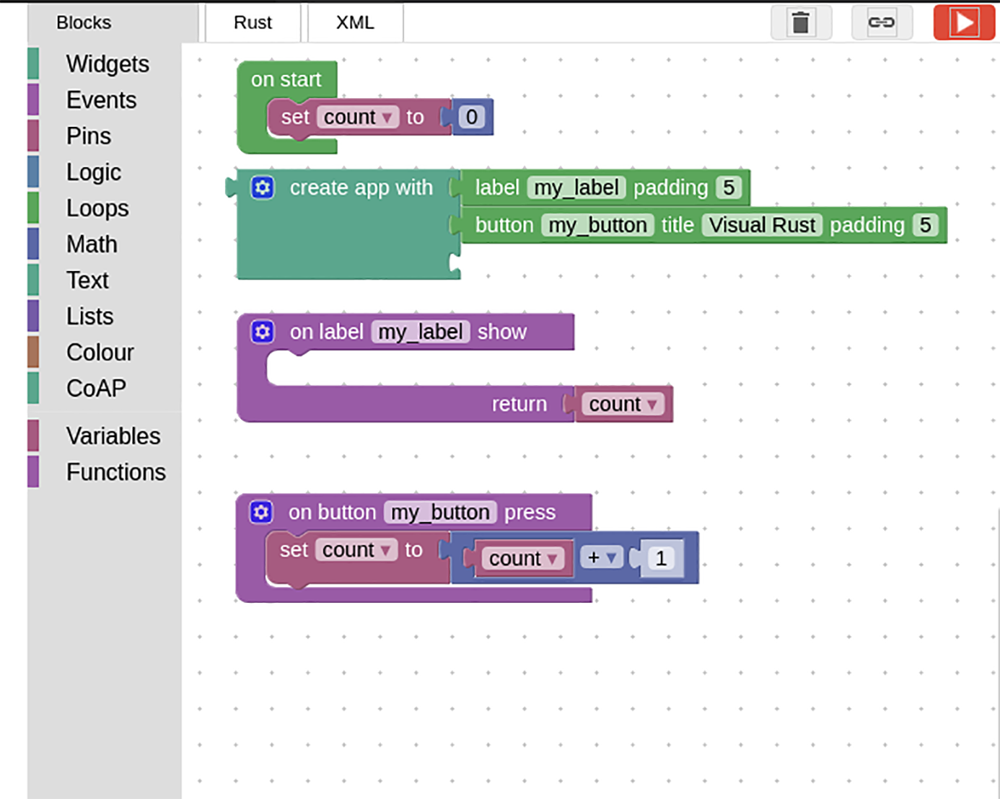

# visual-embedded-rust

Create and edit Embedded Rust programs visually by dragging and dropping blocks

## Features

Watch the demo: https://youtu.be/jYo8B8c7T3Y

Read the articles...

1. [_"Rust Rocks NB-IoT! STM32 Blue Pill with Quectel BC95-G on Apache Mynewt"_](https://medium.com/@ly.lee/rust-rocks-nb-iot-stm32-blue-pill-with-quectel-bc95-g-on-apache-mynewt-ef62a7e28f7e)

1. [_"Visual Programming with Embedded Rust? Yes we can with Apache Mynewt and Google Blockly!"_](https://medium.com/@ly.lee/visual-programming-with-embedded-rust-yes-we-can-with-apache-mynewt-and-google-blockly-8b67ef7412d7)

## Usage

1. In the Visual Studio Code Explorer, create a new empty Rust source file like `main.rs`

1. Edit the Rust file

1. Click `Visual Editor` at the top right of the editor

1. When prompted to populate the visual program into the Rust source file, click `OK`

1. Click the Rust source file to see the generated Rust code. Save the file to save the visual program. Don't edit the Rust source file manually, always use the visual editor.

[Sample Rust source file containing generated Rust code and XML blocks](https://github.com/lupyuen/stm32bluepill-mynewt-sensor/blob/rust-nbiot/rust/visual/src/lib.rs)



## Inside The Extension

The source code is located at [`github.com/lupyuen/visual-embedded-rust`](https://github.com/lupyuen/visual-embedded-rust)

1. Main logic for the VSCode Extension is in [`extension.ts`](src/extension.ts)

1. The extension creates a [WebView that embeds the HTML code](src/extension.ts#L88-L144) from [Google Blockly](https://developers.google.com/blockly/guides/overview). [HTML code for the WebView is here](src/web.ts)

1. The VSCode Extension and the WebView are running in [separate JavaScript sandboxes](https://code.visualstudio.com/api/extension-guides/webview#scripts-and-message-passing). Hence we'll be using VSCode Message Passing to communicate between the VSCode Extension and WebView, as we shall soon see...

1. [When the WebView loads](media/vscode/storage.js#L59-L71), it fetches the [Blockly XML embedded](src/extension.ts#L155-L202) in the Rust document in VSCode and [notifies the Webview (via Message Passing)](src/extension.ts#L168-L186) to [refresh the Blockly workspace](media/vscode/message.js#L40-L60)

1. When the [visual program is updated](media/vscode/storage.js#L165-L194), the WebView sends the [updated Blockly XML and the generated Rust code (via Message Passing)](media/vscode/message.js#L79-L89) to the VSCode Extension.  The extension [updates the Rust document](src/extension.ts#L203-L223) in VSCode with the Blockly XML and generated Rust Code.

1. The Rust code generator for Blockly is here: [blockly-mynewt-rust](https://github.com/lupyuen/blockly-mynewt-rust/tree/master/generators/rust)

1. [Demo Rust source file is here](https://github.com/lupyuen/stm32bluepill-mynewt-sensor/blob/rust-nbiot/rust/visual/src/lib.rs)

The extension is [published here](https://marketplace.visualstudio.com/items?itemName=LeeLupYuen.visual-embedded-rust)

## Building The Extension

To build the extension, two repositories need to be cloned into the `media` folder: [blockly-mynewt-rust](https://github.com/lupyuen/blockly-mynewt-rust) and [closure-library](https://github.com/google/closure-library):

```bash
cd media
git clone https://github.com/lupyuen/blockly-mynewt-rust
git clone https://github.com/google/closure-library
```